# What openlog does

A tour of the product, screen by screen. Everything here is built and shipped in the current release — the
things deliberately left out are named at the end, because a feature list that only lists wins is not one you
can plan against.

openlog speaks **OTLP** and nothing else: the agents are OpenTelemetry distributions, so the data you send is
portable and the platform has no private wire format to lock you in.

---

## One installation, four signals

Infrastructure, APM, logs and browser monitoring land in the same place, keyed the same way, queried by the
same language. A host, a container, a service, a browser session and a log line are joined by the ids they
already carry — not by a correlation feature bolted on afterwards.

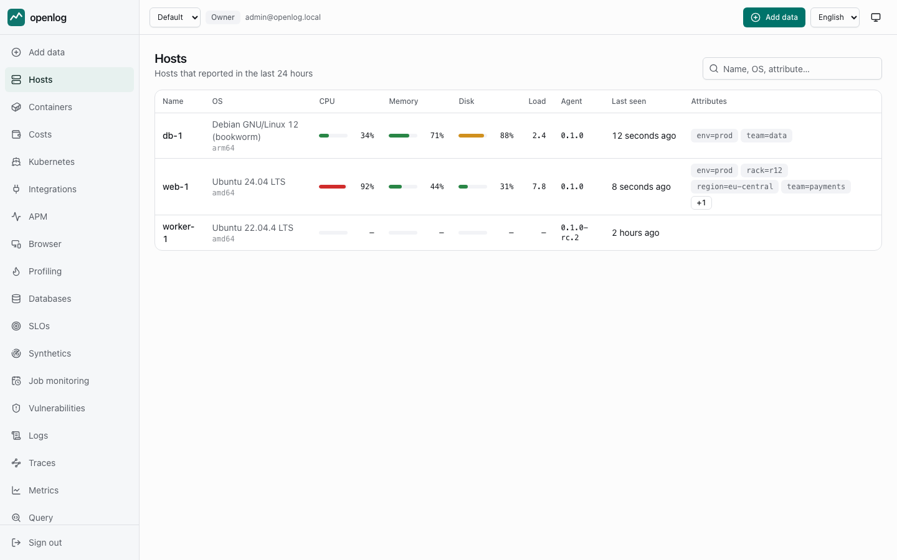

- **Hosts** — CPU, memory, filesystem, disk and network, process metrics, uptime, and the services discovered
  on the machine. Linux, macOS and Windows, amd64 and arm64.
- **Containers** — cgroup v2 metrics, status and restarts, Docker Compose and Kubernetes names, and the
  container's own logs. containerd and CRI-O through the CRI API, not just Docker.
- **Kubernetes** — nodes, workloads, pods and cluster events, from the same agent binary in two modes
  (DaemonSet and a leader-elected cluster collector). No client-go, no sidecar per pod.
- **Inventory** — packages, kernel modules, systemd units, listening ports, users, mounts and more, as full
  snapshots you can search across the fleet. Secrets are masked before they leave the machine; environment
  variables and file contents are never collected.

---

## APM that follows a request end to end

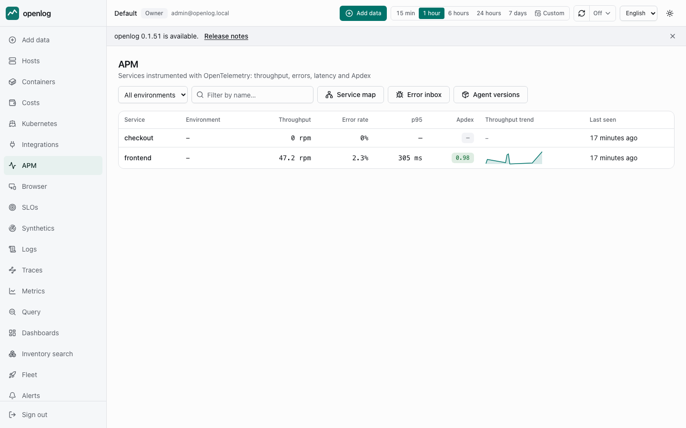

Throughput, error rate, latency percentiles and Apdex per service, with the transactions, database queries
and traces behind them. Deployment markers sit on the charts, and a before/after comparison answers "did that
release make it worse" without a spreadsheet.

**Agents for Go, Node.js, Python, Java, .NET and PHP.** The PHP one is our own C extension covering PHP
7.1–8.4, including Laravel, Symfony, WordPress and the worker runtimes (Octane, RoadRunner, Swoole,
FrankenPHP) — function-level detail, not just request timing.

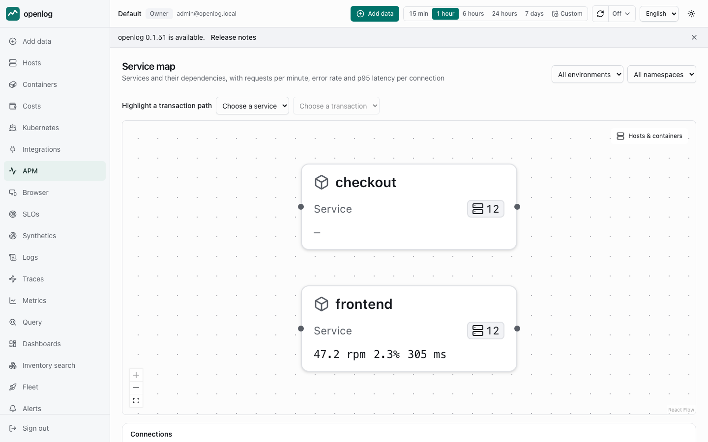

The **service map** is drawn from real traffic: attribute edges and trace-linked edges, filtered by
environment and namespace, with the hosts and containers behind each node.

---

## Continuous profiling

CPU profiles from your own services, as a flame graph and as self time per function, so a slow transaction
has an answer behind it instead of a shrug. Profiles arrive as OTLP like everything else and are queryable
in OQL as `Profile`.

The **Go** agent profiles on by default — the cost is a few percent of one core, and a service nobody
profiled is a service whose slow span has no explanation. The **Node.js** agent samples V8 and is off by
default (`OPENLOG_PROFILING=true`), because switching a new signal on for everyone who upgrades would
multiply what they store without anyone asking.

Everything that is *not* instrumented — a database, a PHP-FPM pool, a cron job, a kernel thread — can be
profiled too, by a separate **eBPF whole-host profiler**, which `install.sh` installs alongside the agent
(`--no-ebpf-profiler` leaves it out). It samples
every process on the machine and names the frames from each binary's symbols. It is its own package
because it runs with `CAP_BPF` and `CAP_PERFMON`, which the infra agent deliberately does not have; an
operator who never installs it keeps that posture exactly.

That is profiling, not auto-instrumentation: it produces flame graphs, not spans, and the entry below
about eBPF auto-instrumentation is still accurate.

---

## An error inbox, not an error list

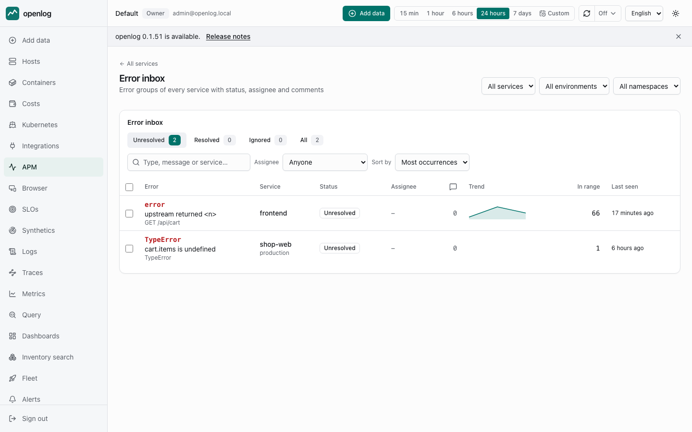

Errors are grouped by a fingerprint that survives a deploy — content hashes in bundle names, Go func
literals, Java lambda and proxy numbers, PHP anonymous classes are all normalized away — so "the same error"
stays the same row across releases. Each group carries state (`unresolved` / `resolved` / `ignored`), an
assignee, comments, an activity trail, and the versions, hosts, containers and transactions it affected.
A group that comes back after a resolve **reopens itself** and says which version regressed.

Browser errors land in this same inbox. There is deliberately no second inbox for the frontend: one error,
one place to resolve it.

---

## Real user monitoring

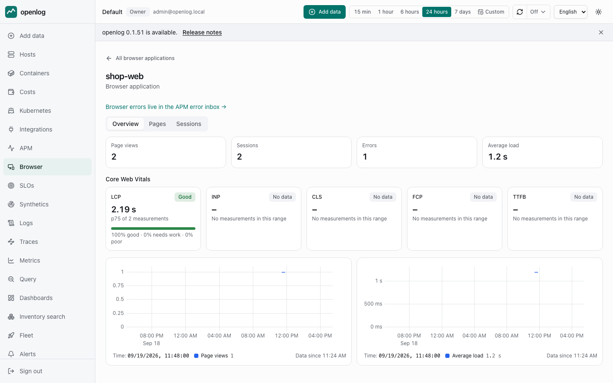

The browser SDK is dependency-free and about 10 KB gzipped. It reports **Core Web Vitals** (LCP, INP, CLS,
FCP, TTFB), the eight Navigation Timing phases, SPA route changes, JavaScript errors and every `fetch`/`XHR`
call — and because a page view is the root of the trace, one trace runs from the click through your backend
to the database.

- Vitals are scored on the p75 against the published Core Web Vitals thresholds, which are constants here,
  not settings: a number that means the same thing everywhere is the point of the programme.
- A session is a **visit, not a person**: a random, per-tab id that expires. Nothing identifies a visitor,
  which is what makes it collectable without a consent banner.
- **Source maps** un-minify browser stacks, so a frame reads `at greet (src/app.ts:5:3)` instead of
  `at n (main.3f2a1b9c.js:1:842)`.
- **Mobile SDKs** for iOS (Swift), Android (Kotlin/JVM) and Flutter (Dart) report screens, errors, custom
  events and identity through the same pipeline. A mobile key is scoped by an application allowlist rather
  than an origin, since a mobile app has none.

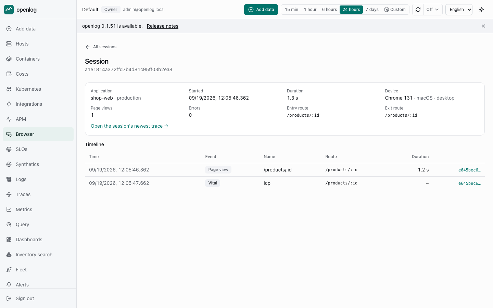

---

## Logs, traces and metrics you can actually search

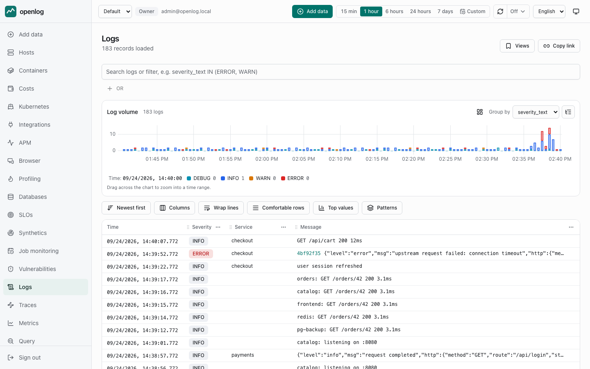

One filter model over top-level fields, attributes, resource attributes and JSON bodies, with sixteen
operators and OR-groups — the same model in the logs, traces and metrics explorers, with key and value
autocomplete from an index that is built as data arrives.

- **Log patterns** cluster millions of lines into the handful of templates they came from, so a spike shows
  you *what* is spiking.
- **Log ↔ trace** navigation works in both directions, and a metric chart's **exemplars** jump straight to a
  trace that produced the data point.

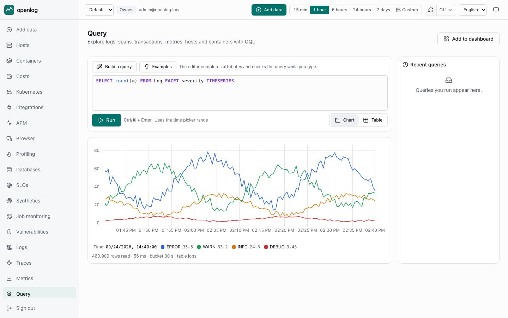

**OQL** is the query language: `SELECT percentile(duration, 95) FROM Transaction WHERE service = 'api' FACET
route TIMESERIES AUTO`. It compiles to parameterized ClickHouse SQL through a whitelist, runs as a read-only
user with per-organization limits, and reports syntax errors with a byte offset. A guided builder writes it
for you when you do not know the schema yet.

---

## Dashboards

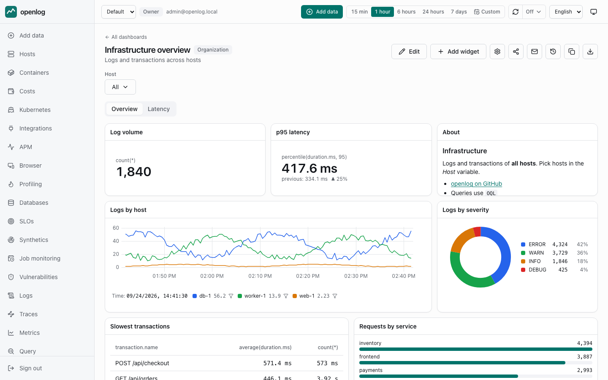

Lines, areas, bars, tables, billboards, pies, heatmaps and markdown on a 12-column grid, with variables,
cross-widget filters, version history (diff and restore), import/export, expiring public share links and
scheduled PDF-quality PNG reports by e-mail.

---

## Alerting that respects your night

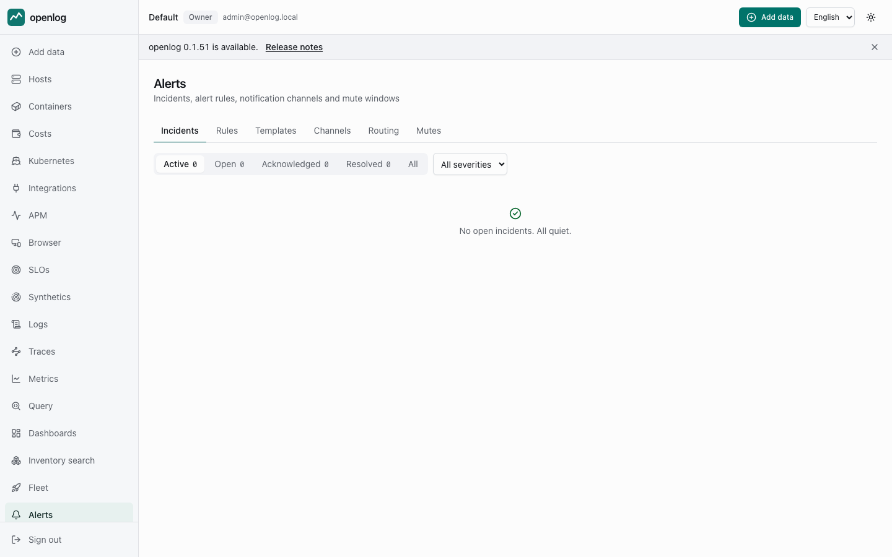

Ten rule types — metric thresholds, log matches, no-data, discovery events, APM (error rate, latency,
Apdex), APM silence, APM error groups, OQL, **SLO burn rate** and **baseline anomaly** — each with
hysteresis, `for`/recovery windows, flapping protection, renotification and multi-dimensional grouping.

- **Routing rules** decide which channel an incident reaches, by severity, service, rule type, labels or the
  local time of day.
- **Mute windows** understand recurrence and holidays, in your timezone, with DST handled.
- Channels: Slack, e-mail, signed webhooks, Microsoft Teams, **PagerDuty** (Events API v2) and **Opsgenie**,
  with an outbox so a notification is not lost when a channel is down.
- Delivery is exactly-once per transition: evaluation runs under a PostgreSQL lease with fencing, so two
  replicas cannot both page you.

**SLOs** (availability or latency, 7/28/30-day rolling windows) compute the error budget and burn rate at
query time, and the multi-window multi-burn-rate rule is one checkbox away.

**Synthetics** call your endpoints on a schedule and record uptime, latency and what came back — as results
*and* as ordinary metrics, so your existing alert rules and dashboards work on them unchanged.

---

## Run it yourself, update it safely

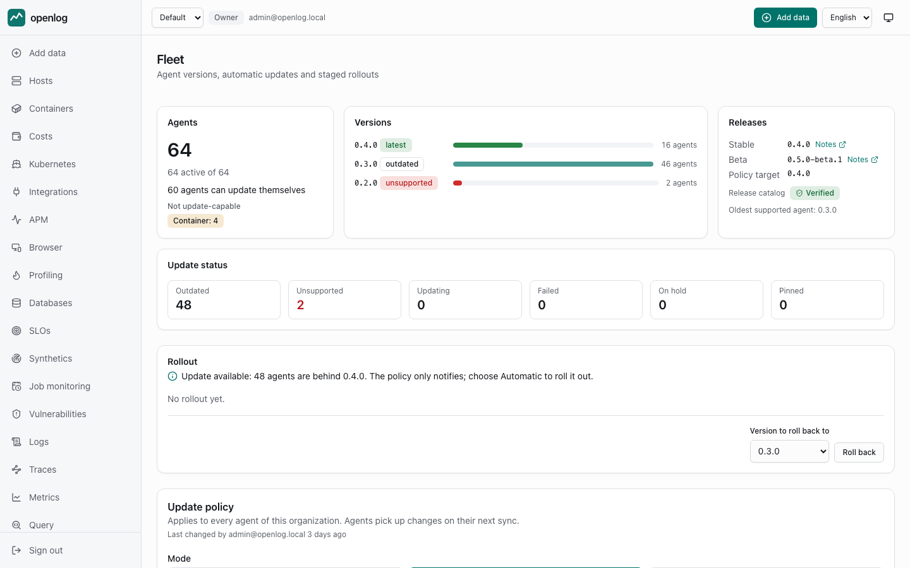

- **One version across everything** — backend, UI, chart, images and agents — published as a signed release
  manifest. The updater takes a PostgreSQL backup, applies expand/contract migrations, health-checks the new
  version and **rolls back** on failure.
- **Fleet** rolls agents out in waves (10% → 50% → 100%), honours maintenance windows, halts automatically on
  a failure rate, and lets you hold or pin a single host.
- **Deploy** with Docker Compose on one machine or the Helm chart on a cluster (Strimzi, Altinity and CNPG
  operators), with tiered storage moving cold data to S3.
- **Terraform provider** for alert rules, channels, routing, SLOs and dashboards; an **MCP server** so an AI
  assistant can query your telemetry read-only.

---

## Multi-tenant from the first line

Organizations are tenants, and the tenant comes **only** from the authenticated principal — no endpoint
accepts a tenant parameter, and the query layer injects the predicate itself. Around that: SSO (OIDC and
SAML, with SLO and back-channel logout), SCIM provisioning, four roles, API keys that carry their own role,
an audit log of every write, quotas and plans, per-tenant retention, data export and deletion with a
certificate at the end.

---

## What is not here

Named on purpose, so you can plan:

- **eBPF auto-instrumentation** — not built. Instrumenting a process without touching its code is a later
  milestone.
- **Session replay** — out of scope.
- **Cloud billing** — the cost screens estimate from your own telemetry; openlog never reads a provider's
  bill, and only compute is priced.
- **Synthetic checks run from one location** — the openlog server itself. The check types are HTTP, TCP, DNS
  and TLS certificate expiry.
- **No `rum` alert rule type**, and that is deliberate: the `oql` rule type runs any OQL query, and RUM page
  views, vitals and sessions are OQL event types, so alerting on them needs no rule type of its own.

More detail on any of these: the [contracts](contracts/) describe every signal, endpoint and guarantee, and
[the roadmap](plan/06-roadmap.md) lists what is validated and what is still open.
